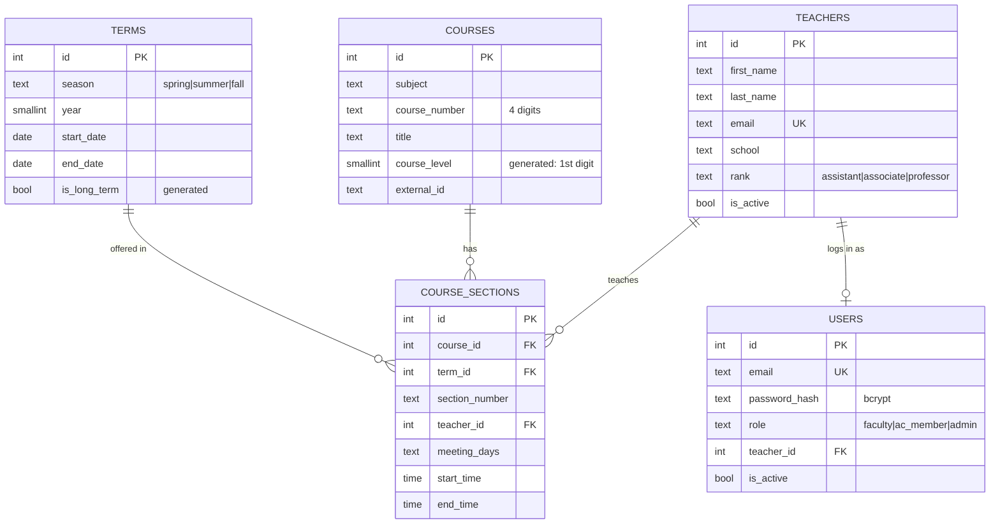

# EvalHub — Database schema (Sprint 1 / Week 1)

PostgreSQL 14+. Source of truth: [`db/migrations/001_initial_schema.sql`](../db/migrations/001_initial_schema.sql) (Sprint 1 — teachers, courses, sections, users) and [`db/migrations/002_assessment_workflow.sql`](../db/migrations/002_assessment_workflow.sql) (Sprint 2 — assessments, candidates, observations, criteria, feedback). Diagram: [`erd.png`](erd.png).

| Table | Purpose |
|---|---|
| `terms` | Spring / Summer / Fall terms; `is_long_term` (generated) is false for Summer. |
| `teachers` | Faculty profile: name, email (unique, case-insensitive), home `school` code (ECS, EPPS, …), rank (`assistant_professor` / `associate_professor` / `full_professor`), `is_active`. Test data uses personas (Professor A, B, C…), never real names. |
| `users` | Login accounts; role `faculty` \| `ac_member` \| `admin`; non-admins link to a teacher. Passwords stored as bcrypt hashes. |
| `courses` | Subject + owning `school` + 4-digit number + title. `course_level` is **generated** from the first digit. |
| `course_sections` | One offering = course + term + section number + instructor. This is the teaching-history data the matching query and the UTD Course Book integration read/write. |
| `app_settings` | Tunable rules: candidate list size (5), observer look-back (2 years), retry window (3–4 weeks). |
| `assessments` | **One row per (teacher, section) sign-up** — not per teacher per term. A section can be claimed by only one assessment (`UNIQUE(section_id)`), matching Q&A 18: "for one course/section there will be only 1 observation." |
| `candidate_lists` | Snapshot each time observer candidates are surfaced: `target_school`/`target_level` (captured at generation time), `pool_size` (eligible found) vs `list_size` (returned, capped at 5). |
| `observer_candidates` | The (up to) 5 observers in a list, in display order. |
| `observations` | Observer/observee record per attempt (`attempt_no`), with AC review and both sign-offs enforced by CHECK constraints (human-in-the-loop). |
| `evaluation_criteria` | AC-configurable criteria, weights, max score. |
| `process_feedback` | Post-observation process survey (max one response per participant). |

## Requirement → schema map (Sprint 2 additions)

| Requirement (Q&A / 9/11 summary) | Where it lives |
|---|---|
| One observation per course/section; multiple sign-ups allowed (Q&A 17, 18) | `assessments.section_id` is `UNIQUE`; multiple rows per `teacher_id` are fine |
| Match by course level + same school, taught in last 2 years (Q&A 8) | `courses.school`/`course_level`, `teachers.school`, `course_sections`; query in `db/queries/eligible_observers.sql` |
| Exactly 5 candidates, random pick if more qualify (Q&A 15) | `app_settings.candidate_list_size`; snapshot in `candidate_lists`/`observer_candidates` |
| New-hire edge case: AC steps in | `observations.is_ac_stepin`, `source_list_id` nullable |
| Human-in-the-loop, system never auto-sends (kickoff notes) | CHECK: `approved`/`completed`/`not_completed` require `ac_reviewed_at` |
| Both observer and observee sign off (9/11 summary) | CHECK: `completed` requires both sign-off timestamps |
| Retry in ~3–4 weeks, then AC / postponement (9/11 summary) | `observations.attempt_no`, `retry_after`; window in `app_settings` |
| Observation form is a DOCX, not for analysis (Q&A 19) | `observations.form_file_ref` (pointer only) |
| Evaluation criteria AC-configurable (9/11 summary) | `evaluation_criteria` |
| Process feedback form (Q&A 19) | `process_feedback` |

## Design decisions

- **`assessments` is per (teacher, section), not per (teacher, term).** The original sprint plan implied one assessment per teacher per due term; Q&A 18 corrects this — a teacher may sign up for multiple sections, but each section can only be claimed once (`UNIQUE(section_id)`).
- **This migration covers the data layer and sign-up API** (`POST /assessments/sign-up`, `app_settings`). The matching/candidate-generation endpoint and the AC-approval + sign-off endpoints build on top of these tables and aren't written yet — `db/queries/eligible_observers.sql` has the reference query for whoever picks that up.
- **Plain SQL migrations** run by a small runner (`npm run migrate`), tracked in `schema_migrations`. Schema changes are new numbered files; applied files are never edited.
- **School lives on both teachers and courses.** The Q&A (question 8) defines observer eligibility by *school + course level*: an ECS 1000-level instructor may observe any ECS 1000-level course; an EPPS 1000-level instructor may not. Storing `courses.school` and `teachers.school` supports that in Sprint 2. School is a short upper-case code, normalised by the API.
- **`course_level` is derived in the database** from the first digit of the course number, so it cannot disagree with the number. Different subjects in the same school and level count as the same category (9/11 summary).
- **No focus-area column.** The 9/11 meeting replaced focus-area matching with course-level matching.
- **Teachers are soft-deleted** (`is_active = false`) because sections and user accounts reference them.
- **`TEXT + CHECK`** for `rank` / `role` instead of Postgres enums — easier to extend in a later migration.
- **Personas, not real people,** in all seed data (9/11 summary).

## Sprint 2 status

Built (this migration): `assessments`, `candidate_lists`, `observer_candidates`, `observations`, `evaluation_criteria`, `process_feedback`, `app_settings`; sign-up API (`GET /assessments`, `GET /assessments/mine`, `GET /assessments/:id`, `POST /assessments/sign-up`, `POST /assessments/:id/cancel`).

Not built yet (see `docs/api-contract.md` for the full list):
- `POST /assessments/:id/candidates` — generate ~5 observer candidates
- `POST /assessments/:id/observations` — record the chosen observer
- `POST /observations/:id/review` — AC approve/reject
- `POST /observations/:id/sign-off` — observer/observee confirm
- `POST /observations/:id/feedback` — process feedback
- Evaluation criteria CRUD

## Open questions

1. **Single Sign On.** Q&A 19 specifies "Web form with Single Sign On" for the sign-up, confirmation and feedback forms. Our Sprint 1 plan is local JWT login. Ask whether SSO means UTD NetID or just a single login; if a real SSO provider is needed, a free/open-source option that runs on a VM (e.g. Keycloak) would need to be evaluated.
2. **Course Book data.** For the proof of concept, courses may be downloaded (Q&A 7, 9/11 summary). Downloaded data has real instructor names, which must be replaced by personas — an import script with a persona mapping is needed. Also confirm one instructor per section.
3. **Subject → school mapping.** Course Book lists a subject prefix (e.g. CS); the importer must map it to a school code.
4. **Hosting.** Requirements say the app must run on a VM and not use trial versions (Q&A 9). The architecture diagram shows Render/Railway; `docker-compose.yml` provides Postgres for a VM deployment.
